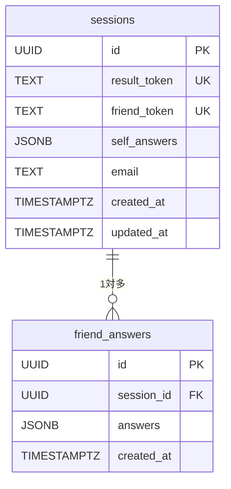

# データベース設計

## 使用DB：Supabase (PostgreSQL)

---

## テーブル定義

### sessions テーブル
自己診断セッションを管理するメインテーブル。

| カラム名 | 型 | 制約 | 説明 |
|---------|-----|------|------|
| id | UUID | PK, DEFAULT gen_random_uuid() | 主キー |
| result_token | TEXT | UNIQUE, NOT NULL | 結果ページURL用トークン |
| friend_token | TEXT | UNIQUE, NOT NULL | 友人診断URL用トークン |
| self_answers | JSONB | NOT NULL | 自己回答配列（32要素, 各1〜5） |
| email | TEXT | NULL | 任意メールアドレス（拡張用） |
| created_at | TIMESTAMPTZ | DEFAULT now() | 作成日時 |
| updated_at | TIMESTAMPTZ | DEFAULT now() | 更新日時 |

### friend_answers テーブル
友人による他者診断の回答を管理するテーブル。

| カラム名 | 型 | 制約 | 説明 |
|---------|-----|------|------|
| id | UUID | PK, DEFAULT gen_random_uuid() | 主キー |
| session_id | UUID | FK → sessions.id | 対象セッション |
| answers | JSONB | NOT NULL | 友人回答配列（32要素, 各1〜5） |
| created_at | TIMESTAMPTZ | DEFAULT now() | 回答日時 |

---

## ER図



---

## JSONB形式（answers）

```json
[3, 5, 2, 4, 1, 5, 3, 4, 2, 5, 1, 3, 4, 2, 5, 3, 4, 1, 5, 2, 3, 4, 5, 1, 2, 4, 3, 5, 1, 4, 2, 3]
```
- 配列の index 0〜31 が Q1〜Q32 に対応
- 各値は 1〜5 の整数

---

## スコア計算ロジック

### 各軸のスコア算出

各軸8問（風寄り4問・岩寄り4問）について：

```
風寄りの質問：回答値をそのまま加算
岩寄りの質問：(6 - 回答値) に変換して加算
合計 8〜40 点 → 25点未満: G（岩）, 25点以上: F（風）
```

同じロジックを4軸すべてに適用し、4文字タイプコードを生成。

### 他者像の算出

```
友人回答が N 件の場合：
  軸ごとに全友人の回答の平均を取る → 同じロジックでタイプ判定
```

---

## Row Level Security (RLS) 設定方針

| テーブル | SELECT | INSERT | UPDATE |
|---------|--------|--------|--------|
| sessions | result_token一致のみ | 全員可 | result_token一致のみ |
| friend_answers | session.result_token一致のみ | friend_token一致のみ | 不可 |

---

## インデックス

```sql
CREATE INDEX idx_sessions_result_token ON sessions(result_token);
CREATE INDEX idx_sessions_friend_token ON sessions(friend_token);
CREATE INDEX idx_friend_answers_session_id ON friend_answers(session_id);
```
