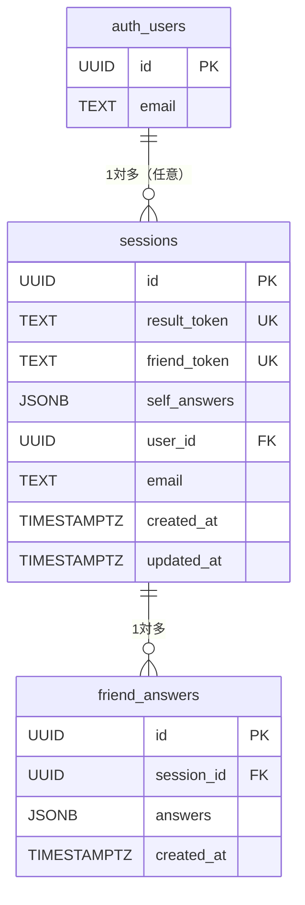

# データベース設計

## 使用DB：Supabase (PostgreSQL) + Supabase Auth

---

## テーブル定義

### sessions テーブル
自己診断セッションを管理するメインテーブル。

| カラム名 | 型 | 制約 | 説明 |
|---------|-----|------|------|
| id | UUID | PK, DEFAULT gen_random_uuid() | 主キー |
| result_token | TEXT | UNIQUE, NOT NULL | 結果ページURL用トークン |
| friend_token | TEXT | UNIQUE, NOT NULL | 友人診断URL用トークン |
| self_answers | JSONB | NOT NULL | 自己回答配列（32要素, 各1〜5） |
| user_id | UUID | FK → auth.users(id), NULL許可 | ログイン済みユーザーのID |
| email | TEXT | NULL | 任意メールアドレス（拡張用） |
| created_at | TIMESTAMPTZ | DEFAULT now() | 作成日時 |
| updated_at | TIMESTAMPTZ | DEFAULT now() | 更新日時 |

### friend_answers テーブル
友人による他者診断の回答を管理するテーブル。

| カラム名 | 型 | 制約 | 説明 |
|---------|-----|------|------|
| id | UUID | PK, DEFAULT gen_random_uuid() | 主キー |
| session_id | UUID | FK → sessions.id | 対象セッション |
| answers | JSONB | NOT NULL | 友人回答配列（32要素, 各1〜5） |
| created_at | TIMESTAMPTZ | DEFAULT now() | 回答日時 |

### auth.users（Supabase Auth管理）
| カラム | 説明 |
|--------|------|
| id | UUID（sessions.user_idが参照） |
| email | メールアドレス |
| encrypted_password | ハッシュ化パスワード |

---

## ER図



---

## スコア計算ロジック

### 各軸のスコア算出

各軸8問（左極寄り4問・右極寄り4問）について：

```
左極寄りの質問：回答値をそのまま加算
右極寄りの質問：(6 - 回答値) に変換して加算
合計 8〜40 点 → 25点未満: 右極, 25点以上: 左極
```

| 軸 | 左極 | コード | 右極 | コード |
|---|---|---|---|---|
| 行動様式 | 即断即行 | F（風） | 熟考慎重 | G（岩） |
| 対人距離 | 社交開放 | Y（野） | 内向静穏 | R（林） |
| 感情表現 | 感情発露 | K（火） | 冷静沈着 | H（氷） |
| 価値基準 | 共感重視 | T（月） | 論理重視 | S（山） |

---

## Row Level Security (RLS)

| テーブル | ポリシー | 条件 |
|---------|---------|------|
| sessions | SELECT | result_token一致 OR auth.uid() = user_id |
| sessions | INSERT | 全員可 |
| sessions | UPDATE | result_token一致 OR auth.uid() = user_id |
| friend_answers | SELECT | session経由でresult_token一致 |
| friend_answers | INSERT | friend_token一致 |

---

## インデックス

```sql
CREATE INDEX idx_sessions_result_token ON sessions(result_token);
CREATE INDEX idx_sessions_friend_token ON sessions(friend_token);
CREATE INDEX idx_sessions_user_id ON sessions(user_id);
CREATE INDEX idx_friend_answers_session_id ON friend_answers(session_id);
```
